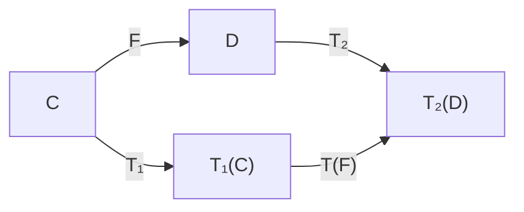
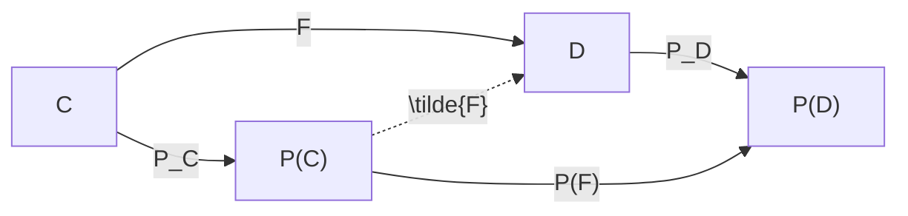

**[Back to Table of Contents](README.md)**

# Thin Categories (7)  
Thinning of Functors

Suppose the following categories and functors are given:

- Locally small categories $\mathcal{C}$ and $\mathcal{D}$
- Thin categories $C_A = \mathcal{C}(A, f)$ and $C_B = \mathcal{C}(B, g)$
- Functor $F: \mathcal{C} \to \mathcal{D}$
- Functors to thin categories $T_1: \mathcal{C} \to C_A$ and $T_2: \mathcal{D} \to C_B$

Given $T = (T_1, T_2)$, we define the functor $T(F): T_1(\mathcal{C}) \to T_2(\mathcal{D})$ as follows.

**On objects**  
For any object $i \in\mathcal{C}, T(F)(T_1(i)) := T_2(F(i)).$

**On morphisms**  
For any morphism $p : i \to j \in\mathcal{C}, T(F)(f_{T_1(i)T_1(j)}) := g_{T_2(F(i))T_2(F(j))}.$

That $T(F)$ is a functor is guaranteed by Proposition 3-1 in "Thin Categories (3)". Moreover, since $T(F)$ is surjective on objects, it is **essentially surjective**, and satisfies
$T(F) \circ T_1 = T_2 \circ F.$

## Example: Thinning via the Packed Arrows Functor

Let $F: \mathcal{C} \to \mathcal{D}$ be a functor between locally small categories. Using the packed arrows functors
$P_\mathcal{C} : \mathcal{C} \to P(\mathcal{C}), \quad P_\mathcal{D} : \mathcal{D} \to P(\mathcal{D})$
defined in "Thin Categories (4)", set $P = (P_\mathcal{C}, P_\mathcal{D})$. Then the thinning of $F$ by $P$ is the functor
$P(F) : P(\mathcal{C}) \to P(\mathcal{D})$
given by $P(F)(i) = F(i), P(F)(Hom(i,j)) = Hom(F(i), F(j))$
for $i,j \in Ob(\mathcal{C})$.

Since $P(\mathcal{C})$ is a strongly connected category, by Lemma 3-1 in "Thin Categories (3)", $P(F)$ is always an equivalence, regardless of the choice of $F$.

In particular, when $\mathcal{D}$ is a thin category, by the universal property of the packed arrows functor (Proposition 4-5 in "Thin Categories (4)"), for any thinning functor $F: \mathcal{C} \to \mathcal{D}$ there exists a unique functor $\tilde{F} : P(\mathcal{C}) \to \mathcal{D}$ such that
$F = \tilde{F} \circ P_\mathcal{C}.$
Looking at the domains and codomains of these functors, we also have
$P(F) = P_\mathcal{D} \circ \tilde{F} .$

## General Properties of $T(F)$

**Proposition 7-1**  
If $F$ is an equivalence, then so is $T(F)$.

**Proof**  
By assumption, $F$ is full. Therefore, for any $i,j \in Ob(\mathcal{C})$, there exists a morphism $p : i \to j$ in $\mathcal{C}$ such that the morphism $F(i) \to F(j)$ in $\mathcal{D}$ is given by $F(p)$.

Then, for any $i,j \in Ob(\mathcal{C})$,
$g_{T_2(F(i))T_2(F(j))} = T_2(F(p)) = (T_2 \circ F)(p) = (T(F) \circ T_1)(p) = T(F)(T_1(p)).$
Thus $T(F)$ is full, and hence an equivalence. (Proof complete)

**Example. (A thin-categorical interpretation of topological invariants)**

Let $\mathcal{C}$ and $\mathcal{D}$ be categories of topological spaces (objects are topological spaces, morphisms are continuous maps), and let
$F ⁣:\mathcal{C} \to \mathcal{D}$ be the functor induced by continuous maps.  Let $C_A = C(A,f)$ be the thin category of topological invariants of objects of $\mathcal{C}$ (homology groups, cohomology rings, homotopy groups, etc.), and let $C_B = C(B,g)$ be the corresponding thin category of topological invariants of objects of $\mathcal{D}$. Via the thinning functors
$T_1 ⁣:\mathcal{C} \to C_A, T_2:\mathcal{D} \to C_B$, we regard
$T(F) ⁣: T_1(\mathcal{C}) \to T_2(\mathcal{D})$ as the functor that a continuous map induces between topological invariants.  In this setting, the fundamental fact that a homeomorphism induces an isomorphism of topological invariants holds. This corresponds structurally to the proposition  “If $F$ is an equivalence of categories, then $T(F)$ is also an equivalence of categories.”  
Indeed, topological invariants such as homology are typical examples of thinning: they project the “thick” structure of a topological space onto numerical or algebraic “thin” data. A strong equivalence relation such as homeomorphism is preserved as an isomorphism after this thinning.  This property may be viewed as a categorical interpretation of the classical technique that detects essential differences between continuous maps of topological spaces by first passing them through a thin filter (topological invariants).  One might even define the notion of a “topological invariant” as a pair of thin categories $C_A$ and $C_B$ for which thinning functors $T(F)$ can be defined with respect to the categories $\mathcal{C}$ and $\mathcal{D}$ of topological spaces.

**Proposition 7-2**  
If $F$ is a (left) adjoint functor, then so is $T(F)$.

**Proof**  
Suppose $F: \mathcal{C} \to \mathcal{D}$ is left adjoint to $G: \mathcal{D} \to \mathcal{C}$. Then for every object $i \in Ob(\mathcal{C})$, there exists a pair $(F(i), \eta_i)$ satisfying the following two conditions:

1. $\eta_i : i \to G(F(i))$ is a morphism in $\mathcal{C}$.
2. For every object $k \in Ob(\mathcal{D})$ and every morphism $p : i \to G(k)$, there exists a unique morphism $q : F(i) \to k$ in $\mathcal{D}$ such that $p = G(q) \circ \eta_i$.

Let $T' = (T_2, T_1)$. We show that $T(F) : T_1(\mathcal{C}) \to T_2(\mathcal{D})$ is left adjoint to $T'(G) : T_2(\mathcal{D}) \to T_1(\mathcal{C})$.

1. For any object $T_1(i)$ in $T_1(\mathcal{C})$, define
   $\bar{\eta}{T_1(i)}:= T_1(\eta_i) : T_1(i) \to T_1(G(F(i))).$
   Since $T_1(G(F(i))) = T'(G)(T_2(F(i))) = T'(G)(T(F)(T_1(i)))$, $\bar{\eta}_{T_1(i)}$ is a morphism in $T_1(\mathcal{C})$ from $T_1(i)$ to $T'(G)(T(F)(T_1(i)))$.

2. Let $T_2(k)$ be an arbitrary object in $T_2(\mathcal{D})$, and let $\bar{p} : T_1(i) \to T'(G)(T_2(k))$ be an arbitrary morphism. We show that there exists a unique morphism $\bar{q} : T(F)(T_1(i)) \to T_2(k)$ in $T_2(\mathcal{D})$.

   **Existence**: By assumption, there exists a morphism $q : F(i) \to k$ in $\mathcal{D}$. Applying $T_2$, we obtain the morphism $g_{T_2(F(i)), T_2(k)}$ in $T_2(\mathcal{D})$, which we take as $\bar{q}$.

   **Commutativity**: In $T_1(\mathcal{C})$, consider the composite $\bar{p}$ and $T'(G)(\bar{q}) \circ \bar{\eta}{T_1(i)}$. Since $\mathcal{D}$ (and thus $T_2(\mathcal{D})$) is thin, morphisms are unique when they exist between the same pair of objects. As both composites have the same domain $T_1(i)$ and codomain $T'(G)(T_2(k))$, we have $ \bar{p} = T'(G)(\bar{q}) \circ \bar{\eta}_{T_1(i)}.$

3. **Uniqueness**: The uniqueness of $\bar{q}$ follows immediately from the fact that $T_2(\mathcal{D})$ is a thin category.

Thus, the pair of functors $(T(F), T'(G))$ satisfies the adjunction $T(F) \dashv T'(G)$. (Proof complete)

**Example. (A thin-categorical interpretation of weak solutions in distribution theory)**
Let $\mathcal{C}$ be a suitable category of function spaces (for instance, the category of smooth functions) and let $\mathcal{D}$ be the category of the corresponding differential equations. Let the functor $F:\mathcal{C} \to \mathcal{D}$ be the operation that assigns to each function its differential equation (i.e., the application of a differential operator).  Let $C_A = C(A,f)$ be the thin category of distributions (or hyperfunctions) and let $C_B = C(B,g)$ be the thin category of differential equations for distributions. Via the thinning functors $T_1:\mathcal{C} \to C_A, T_2:\mathcal{D} \to C_B$, we regard the induced functor $T(F)⁣:T_1(\mathcal{C}) \to T_2(\mathcal{D})$ as the “distributional version” of the differential operator.  Recall the fundamental property of distribution theory:  “If a classical solution exists, then a weak solution also exists.”  
Its contrapositive reads  “If no weak solution (i.e., no solution in the sense of distributions) exists, then no solution exists in the original function space either.”  
This implication corresponds structurally to the contrapositive of the proposition  “If $F$ is a left adjoint, then $T(F)$ is also a left adjoint.”  

Indeed, the very definition of the weak derivative is the extension of the formal adjoint of a classical differential operator to the distributional setting via the distributional pairing. Consequently, if adjointness fails in the thin world (non-existence of a weak solution), adjointness also fails in the original thick world (non-existence of a classical solution).  This may be viewed as a categorical interpretation of the analytic technique that, for nonlinear or otherwise complicated differential equations, first passes through a “thin filter” (the weak formulation) in order to detect non-existence of solutions.

**Proposition 7-3**  
If $F$ and $F'$ are naturally isomorphic functors, then so are $T(F)$ and $T(F')$.

**Proof**  
Suppose $F$ and $F'$ are naturally isomorphic. Then for every object $i$ in $\mathcal{C}$, there exist morphisms $\alpha_i : F(i) \to F'(i)$ and $\alpha'_i : F'(i) \to F(i)$ such that for every morphism $f : i \to j$ in $\mathcal{C}$,
$\alpha_j \circ F(f) = F'(f) \circ \alpha_i.$

Define $T(\alpha_i) : T_2(F(i)) \to T_2(F'(i))$. Then $T(\alpha'_i) : T_2(F'(i)) \to T_2(F(i))$ is its inverse, and both exist by the functoriality of $T_2$. Moreover,
$T(\alpha_j) \circ T(F(f)) = T(F'(f)) \circ T(\alpha_i).$
This shows that $T(F)$ and $T(F')$ are naturally isomorphic. (Proof complete)

